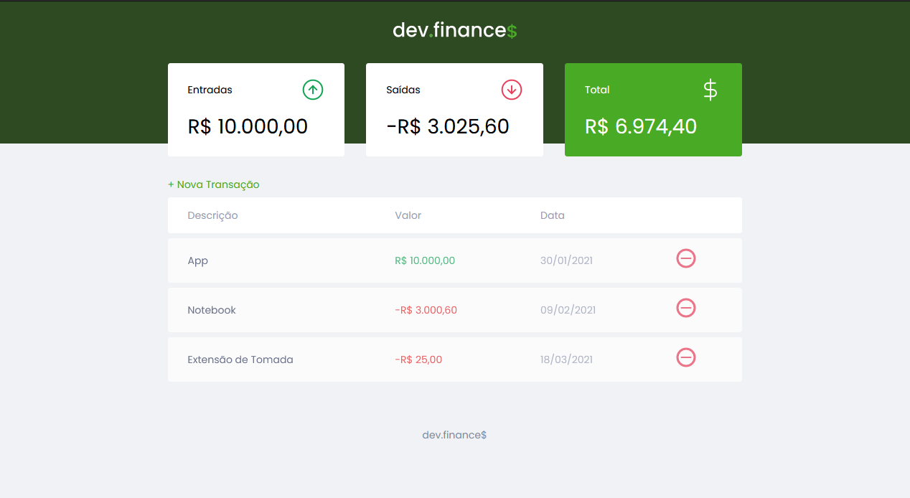

<!-- Title --> 
# Dev Finance$

<!-- Project Image --> 

  

<!-- Who made it --> 
##### Maratona Discovery por [Mayk Brito](https://www.youtube.com/user/maykbrito)
<!-- About the project --> 
## Sobre 
Um evento de programação proporcionado pela [Rocketseat](https://www.youtube.com/channel/UCSfwM5u0Kce6Cce8_S72olg), onde o [Mayk Brito](https://www.youtube.com/user/maykbrito) nos ensinou montando uma aplicação de controle de finanças, onde você pode adicionar seus gastos, e entradas de $$, que serão salvas no seu localStorage.

<!-- Features Used in --> 
## Features 
 * CSS Grid 
 * CSS Flexbox 
 * Javascript 
 * localStorage 

<!-- See website --> 
[Acesse a Aplicação](https://finance-dev.netlify.app/)

### Contato
E-mail: joaog.alvesluiz@gmail.com
